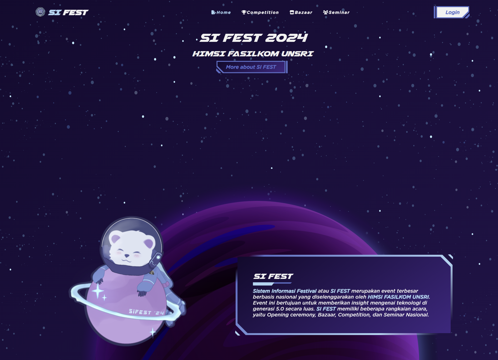
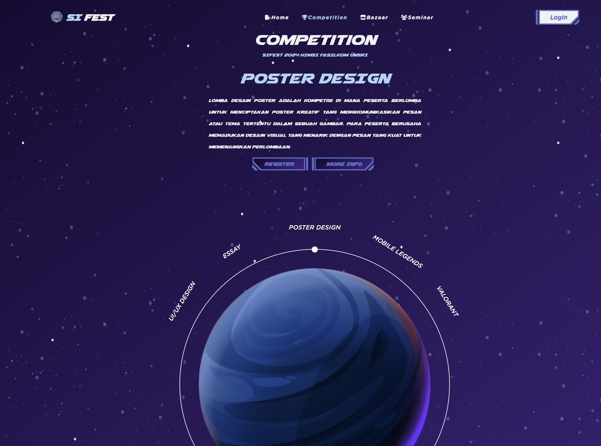
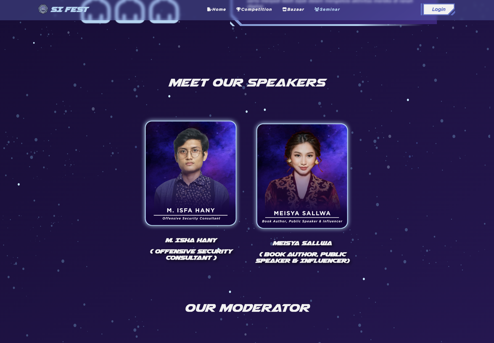
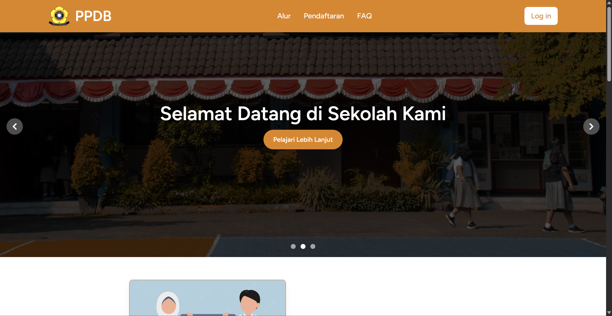
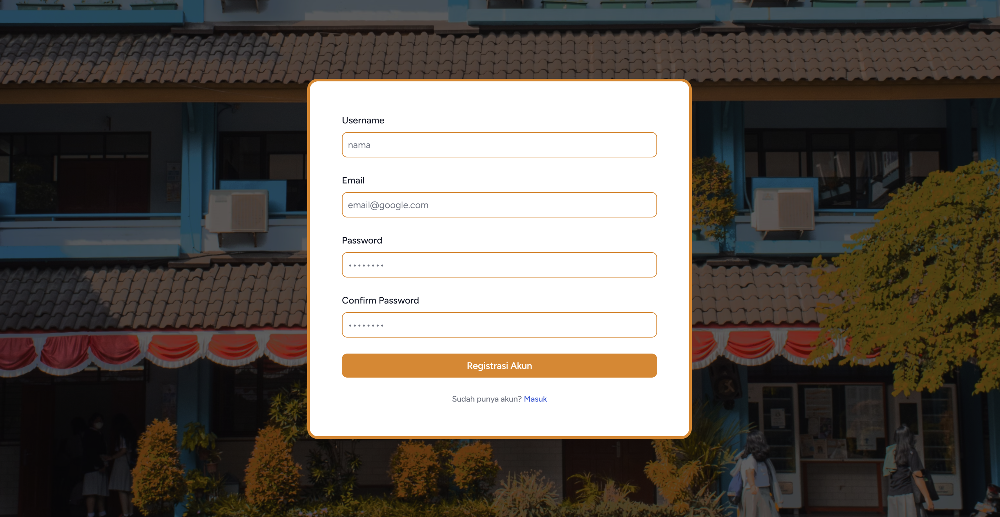
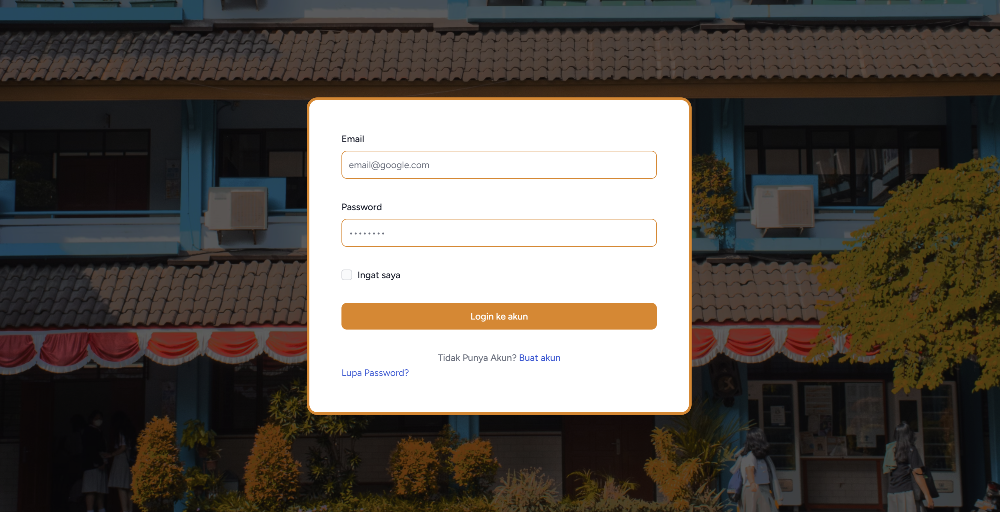

#  My Projects For Now...

List of all the projects i've developed until now.

---

## 🚀 1. SI FEST Website

Platform informasi dan pendaftaran acara tahunan **Sistem Informasi Festival**.

  

  

  

**Tech Stack**: Laravel, Inertia.js, SCSS / SASS  
🔗 [Lihat Proyek](https://github.com/NicolausOwen/Sifest2024)

---

## 🏫 2. SMART_APP
Aplikasi web untuk mempermudah proses **Penerimaan Peserta Didik Baru (PPDB)** secara online. Sistem ini mendukung alur pendaftaran, verifikasi, dan pengumuman hasil seleksi dengan antarmuka yang ramah pengguna.

  

  

  

**Tech Stack**: Laravel, Vue, Inertia.js
🔗 [Lihat Proyek](https://github.com/zakiganteng12/SMART_APP)

---

## 🖼 3. ArtGallery

Aplikasi galeri gambar dengan fitur tambah, edit, dan hapus menggunakan modal Bootstrap.

**Tech Stack**: Laravel, Blade, Bootstrap 5  
🔗 [Lihat Proyek](https://github.com/zakiganteng12/P.PWEB2-ArtGallery)

---

## 🛠 More Coming Soon...

Stay tuned! Proyek baru akan segera ditambahkan di sini 👀✨
